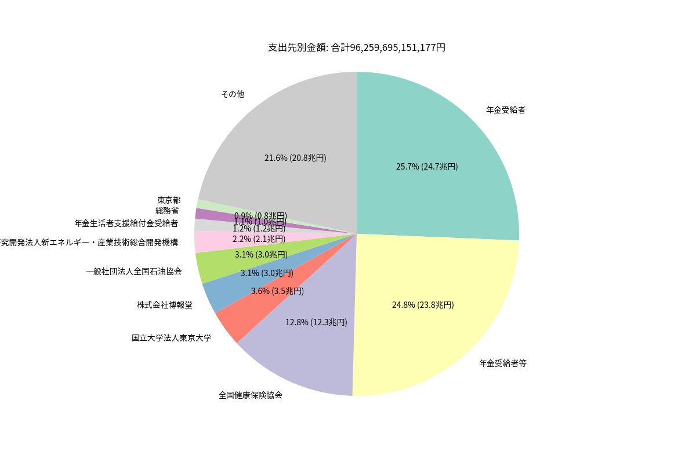

# 日本政府のお金について分析する

## 準備
### 必要なツール
- [uv](https://docs.astral.sh/uv/)

### パッケージをインストール
- `uv sync`

## [行政事業レビュー見える化サイト RSシステム](https://rssystem.go.jp/top)
ダウンロードできるCSVファイルを使って分析を行う。

### 実行
- `uv run main.py`

### 結果
合計金額: 96,259,695,151,177

